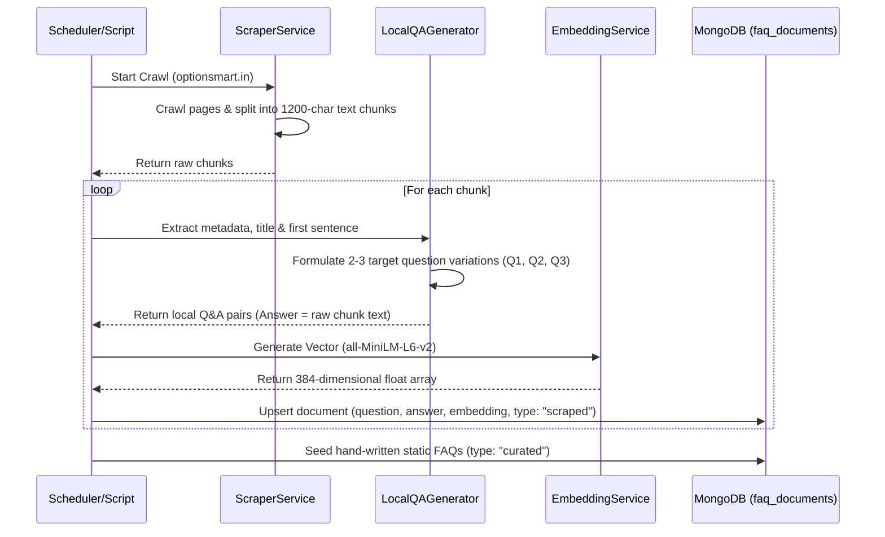
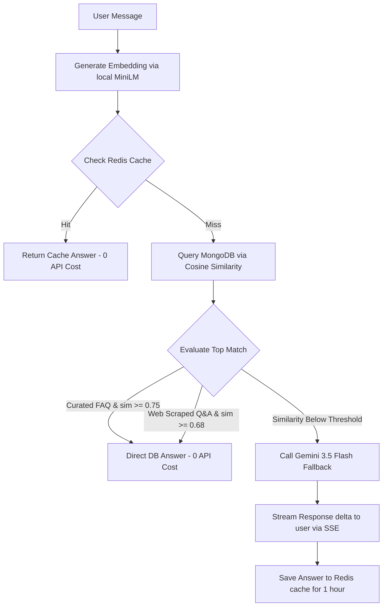

# OptionSmart Chatbot — Architecture & Workflow Guide

OptionSmart Chatbot is a premium, high-performance RAG (Retrieval-Augmented Generation) chatbot application integrated with live Zerodha Kite stock data, a persistent MongoDB Trade Journal, and a dual-layer knowledge base.

---

## 📁 Directory Structure

```
chatbot/
├── frontend/               # React (Vite) Frontend Application
│   ├── src/
│   │   ├── components/     # Chat UI, Trade Journal, Morning Coach, Lead Capture
│   │   ├── hooks/          # Custom SSE streaming & local FAQ lookup hooks
│   │   ├── store/          # Redux state slices (chat, journal, coach)
│   │   └── pages/          # Main ChatPage layout
│   └── package.json
│
├── server/                 # Express Backend API Server
│   ├── data/               # Curated static FAQs (faq.json)
│   ├── models/             # MongoDB Schema & query wrappers (faqDocument, journal)
│   ├── routes/             # API Endpoints (chat, journal, zerodha)
│   ├── services/           # core services (RAG, local embeddings, coach, market data)
│   ├── scripts/            # Database seeding and trigger scripts
│   ├── .env                # Server configuration secrets
│   └── package.json
```

---

## ⚙️ Architecture Overview

The system is designed for **maximum cost-efficiency** by bypassing LLM API calls wherever possible. It achieves this using a **local embedding engine** (MiniLM) and a **waterfall matching strategy**:

```
                  ┌──────────────────────────────┐
                  │      User Question Input     │
                  └──────────────┬───────────────┘
                                 │
                   ┌─────────────▼─────────────┐
                   │    Local Question Embed   │ (Free, Offline MiniLM Model)
                   └─────────────┬─────────────┘
                                 │
                   ┌─────────────▼─────────────┐   YES
                   │   Redis Answer Cache?     ├──────────► [Serve Answer Instantly]
                   └─────────────┬─────────────┘
                                 │ NO
                   ┌─────────────▼─────────────┐
                   │ MongoDB Vector Match?     │
                   │ (Cosine Similarity Score) │
                   └─────────────┬─────────────┘
                                 │
              ┌──────────────────┴──────────────────┐
              ▼ YES (sim ≥ Threshold)               ▼ NO (sim < Threshold)
   ┌───────────────────────────┐         ┌───────────────────────────┐
   │    Direct MongoDB Hit     │         │   Gemini 3.5 Fallback     │
   │ (0 tokens, zero API cost) │         │   (Inject matched context │
   │                           │         │    as system prompt)      │
   └─────────────┬─────────────┘         └─────────────┬─────────────┘
                 │                                     │
                 ▼                                     ▼
     [Return Answer with Badge]               [Stream Response to User]
```

---

## 🔄 Core Workflows

### 1. Website Ingestion & Indexing Workflow (Cron / Script)
This pipeline crawls target websites and builds the semantic search database. It runs locally to avoid API calls and daily Free Tier rate limits:



### 2. Chat Query Workflow (POST /api/chat)
When a user submits a chat message, it goes through this routing decision matrix:



---

## ⚡ Setup & Launch Instructions

### 1. Backend Server Setup
Go to the `server/` directory:
1. Copy `.env.example` to `.env`.
2. Open `.env` and fill in your keys:
   ```env
   GEMINI_API_KEY=your_google_gemini_api_key
   MONGODB_URI=mongodb://localhost:27017
   MONGO_DB_NAME=optionsmart_chat
   REDIS_URL=redis://localhost:6379
   
   # Zerodha login (from developers.kite.trade)
   ZERODHA_API_KEY=your_api_key
   ZERODHA_API_SECRET=your_api_secret
   ```
3. Install dependencies and start the backend:
   ```bash
   npm install
   npm run dev
   ```

### 2. Seeding & Indexing Database
Seed the FAQ and crawled websites before testing the chat:
```bash
# Seed static curated FAQs
node server/scripts/seedMongo.js

# Scrape websites & index local Q&As
node server/scripts/testRefresh.js
```

### 3. Frontend Setup
Go to the `frontend/` directory:
1. Install packages:
   ```bash
   npm install
   ```
2. Start the Vite development proxy server:
   ```bash
   npm run dev
   ```
3. Open `http://localhost:5173` in your browser.

---

## ⚙️ Redis Key Schema

| Key Pattern | Data Type | TTL | Purpose |
|:---|:---|:---|:---|
| `chat:cache:{sha256}` | String | 1 hour | Caches exact repeated questions to bypass DB query entirely |
| `zerodha:token:{uid}` | String | 8 hours | Stores per-user Zerodha session token (expires end-of-day) |
| `zerodha:quote:{symbol}` | String | 15 seconds | Caches live Nifty/VIX pricing data to rate-limit Kite API calls |
